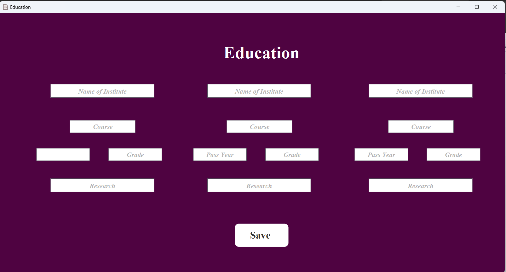

# CV Maker

CV Maker is a Java-based application that simplifies the process of creating professional resumes (CVs). With this application, users can easily input their personal and professional details through an intuitive interface, and the app generates a polished CV which can be downloaded directly to the user's system.

## Features

- **User-friendly Interface**: The application provides a simple and intuitive interface for users to input their details.
- **Customizable CV**: Users have the option to customize the layout and design of their CV according to their preferences.
- **Downloadable CV**: Once the CV is generated, users can download it directly to their system in various formats such as PDF or Word.
- **Java-based**: The application is built using Java, making it platform-independent and easy to run on any system with Java installed.

## Screenshots

### Main Interface

### CV Input Form

### Generated CV

